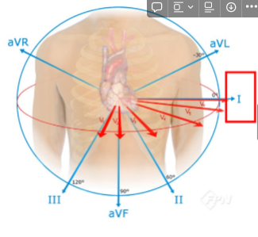

# Readme.md

# ****심전도 (Electrocardiogram) 데이터를 활용한 심방세동(Atrial fibrillation) 검측 모델 개발****

### Team : `하버드(HeartBud)`

### Member : 장보경(ANNIE),  심성식(ASHTON),  정충원(JWON)

### Duration : 2023/11/6 - 2023/12/15

### 대용량 파일 업데이트 안되어 있음
- PTB_XL과  SPH데이터가 빠져 있음.
  아래에서 다운로드하여 각각의 data폴더에 넣어줘야함.
- 각 py혹은 ipynb파일에서 customfile의 주석을 풀고 생성해주어야함

---

1. PTB-XL, a large publicly available electrocardiography dataset

    ◦ URL : https://physionet.org/content/ptb-xl/1.0.3/

    ◦ 다운로드 : 홈페이지 하단의 ‘Download the ZIP file’ 버튼을 누르거나,

     wget -r -N -c -np https://physionet.org/files/ptb-xl/1.0.3/ 명령어를 이용하여 다운로드.

2. SPH, A large-scale multi-label 12-lead electrocardiogram database with standardized diagnostic statements

    ◦ URL : https://doi.org/10.6084/m9.figshare.c.5779802.v1

    ◦ 다운로드 : 홈페이지 하단의 ‘ECG records’ 와 ‘The attributes of ECG records’ 파일을 직접 다운로드.
---

## 문제 배경 및 정의 (DS)

### 문제 정의

심혈관 질환(CVDs)은  사망률이 가장 높은 질병 중 하나이며[1], 최근 고소득 국가에서는 암을 추월한 바가 있다.[2] 

심방 세동은 심방의 수축이 소실되어 불규칙하게 수축하는 상태로, 이는 부정맥의 일종인데, 심방세동을 진단하기 위한 가장 정확한 검사 방법은 심전도이다. 심방세동이 있을경우 심전도에서 불규칙한 맥박 및 불규칙한 이소성 P파와 QRS군이 관찰된다.

심전도(ECG)같은 경우 환자의 전반적인 심장 상태를 평가할 수 있는 매우 일반적인 비침습적 도구로써 심혈관 질환(CVDs)진단을 위한 1차 검사로 사용되는 것에도 불구하고 일반의 또는 긴급하게 심전도를 해석해야 하는 응급실 의사에게는 더더욱 어려운 작업이다. [3][4]

 특히나 앞으로 더욱 커질 원격의료 분야에서의 심방세동 탐지를 위한 심전도 모니터링은 그 중요성이 한층 더 높아질 것으로 예상된다. 

---

### 문제 해결의 필요성

 심방세동은 그 위험성 때문에 조기 진단이 중요하다. 하지만 중요도가 높아진 만큼 수요가 계속 증가하는 상황에서 현재의 한정적인 의료 자원으로 심전도 검사 결과를 신속하게 해석하는 것에 어려움을 겪고 있다. 

 이러한 현실 속에서 딥러닝 기반으로 이 문제를 접근하는 방식은 전문 의료인의 의사결정을 도울 뿐만 아니라 해당 분야에서 의료자원을 효율적으로 활용 할 수 있게되어 전체적인 의료질의 향상과 비용절감을 가져올 수 있고 무엇보다 자동 심전도 해석 알고리즘에 기반한 고급 의사 결정 지원 시스템의 지원을 받은 의료진은 심방세동 위험군에 속한 환자를 조기에 발견하여 치료에 기여 할 수 있다.

---

## 데이터(DS)

### 활용 데이터 및 데이터 활용 계획

- **PTB-XL** 의 데이터를 이용하여 **Train, Valid, Test (Internal validation)**을 진행한다.
    
    10초 길이의 18,885명의 환자로부터 얻은 21,837개의 기록으로 구성된 현재 최대 규모의 자유롭게 접근 가능한 임상 12리드 ECG 파형 데이터 세트
    
- **SPH** 의 데이터는 **Test (External validation)** 으로 활용한다.

1. PTB-XL, a large publicly available electrocardiography dataset ([https://physionet.org/content/ptb-xl/1.0.3/](https://physionet.org/content/ptb-xl/1.0.3/))
2. SPH, A large-scale multi-label 12-lead electrocardiogram database with standardized diagnostic statements ([https://doi.org/10.6084/m9.figshare.c.5779802.v1](https://doi.org/10.6084/m9.figshare.c.5779802.v1))

- **PTB-XL과 SPH의** 심전도 데이터는 12개의 리드가 있다.

       이12개의 리드는 몇개의 전극을 사용해서 측정하는지, 그리고 +극과 -극이 몇개가 어디에 위치 했는지에 따라 나뉘어집니다.

       우리는 이번 프로젝트에서 오른팔에 (-) → 왼팔(+)의 2개 전극으로 측정한 l 리드데이터를 사용하며, 

        AFIB( 'Atrial Fibrillation', 심방 세동)여부를 1,0으로 라벨링하여 예측한다.

---

## 개발 계획 및 일정(DS)

## EDA

**자체적인 EDA** 뿐만 아니라 다양한 **논문**과 **캐글** 등에서 EDA을 **참고 및 구현**해본다.

PTB-XL, SPH 데이터에서 **심박수** 외에 공통적인 데이터 중 **성별**과 **나이**를 사용할 예정.

PTB-XL 데이터 상에 나이와 성별에 따른 심방세동 환자 비율이 의미를 보이고 있으며 관련해서 검색한 내용도 해당 주장을 뒷받침해준다. 

심방세동 가진 환자의 56.6%가 65세 이상이. 모든 연령 대에서 남자가 여자보다 빈도가 높았고, 특히 남녀 모두 80세 이상에서 빈도가 가장 높았다.

입니다. CDC에 따르면 **65세 미만 인구 중 약 2%와 만 65세 이상 인구 중 약 9%**가 심방세동을 앓고 있습니다.[5]

## AI 모델 및 방법

**전처리 프로세스 (학습/평가 데이터 분리, 정규화 등) + 학습 모듈(Dataloader, tranier 등) 개발 + 학습 + 평가, … 등 머신러닝/딥러닝 전체 사이클을 이해하고, 실제 파이썬 스크립트를 작성**

- 다양한 ML모델 뿐만 아니라 CNN, RNN, LSTM, Tranformer등 모델을 활용해본다.
    - 사용하는 **심전도 데이터는 1-Dimension 데이터로서** 500Hz로 10초 동안 수집된 데이터를 사용하므로, 총 5,000개의 timestep을 갖는 신호 데이터를 입력 데이터로 활용하기 때문에 **각 모델 (CNN, RNN, Transformer)이 요구하는 형태에 맞게 Shape을 맞춰서 학습**
    - 추가: XAI (Explainable AI) 기법 적용. Grad-CAM 기법을 습득하여 CNN 모델과 함께 적용하여, 학습한 모델이 입력 데이터의 어느 부분을 보고 추론하였는지 **히트맵 형태로 시각화**
- Activation, Loss function, Optimizer, Dropout, Batch normalization 등 딥러닝에 활용되는 테크닉 알고리즘들을 공부해보고 이를 실제 모델에 반영
    - 생체신호 전처리에 특화된 **Resampling, Normalization(min-max, z-score)** 등의 전처리 기법들을 적용
- 이진 분류 문제에서 클래스 비율이 불균형한 경우에 사용되는 Under/Over-sampling 방법을 적용해보거나, Focal loss 에 대하여 학습한 뒤 적용
- 국내/해외 논문 또는 캐글(Kaggle) 등에서 활용된 접근 방법들을 찾아보고, 본 프로젝트에 적용하거나 새로운 모델 개발

## 평  가

Confusion matrix, Sensitivity(Recall), Specificity, **AUROC (Area Under the Receiver Operating Characteristics)** 등 이진 분류 성능 평가에 사용되는 지표 활용

## **문서화 작업**

- 읽는 사람이 이해하기 쉽도록 **공부한 내용에 대해서 노션에 기록**
- 작성한 모든 코드에 대해서 주석 및 설명을 작성
    - **함수에 대한 설명과 입력/출력 변수에 대한 설명**

---

## 마일스톤

## 개발 일정

### **2023 / 11 / 10 - 13 (7일)**

- 기획안 작성
- 데이터 이해와 탐색 및 관련 모델 리서치와 해당 도메인 지식 탐구.
- 선행적 EDA
- 모델 탐구 및 관련 모델 지식 학습

### **2023 / 11 / 14 - 22 (8일)**

- EDA
- 선행적 모델 탐색 및 모델링

### **2023 / 11 / 23 - 12/ 1 (9일)**

- ML, DL 모델 생성 및 고도화
- 중간발표 준비

### **2023 / 12 / 2 - 10 (10일)**

- 모델의 고도화

### **2023 / 12 / 11 - 13 (3일)**

- 프로젝트 자료 문서화 및 발표준비
- 모델 고도화
- 추가 연구 일정

### **2023 / 12 / 14**

- 발표 준비 및 리허설, QNA 준비
- 발표자료에 12 / 11 - 13일 사이에 이루어진 고도화 및 추가 연구부분 추가
    
---

## 활용 방안 및 기대효과

 전문 의료인의 의사결정을 도울 뿐만 아니라 해당 분야에서 의료 자원을 효율적으로 활용할 수 있게 하여 전체적인 의료질 향상과 비용절감을 가져오고

웨어러블 기기나, 가정용 의료기기 혹은 원격 진료 분야에서 심방세동을 포함한 심혈관 질환(CVDs)을 가진 사람을 조기 발견하여 적기에 치료가 이루어질 수 있도록 도울 수 있다.

---

**REFERENCES** ([https://arxiv.org/pdf/2004.13701.pdf](https://arxiv.org/pdf/2004.13701.pdf))

[1] E. Wilkins, L. Wilson, K. Wickramasinghe, P. Bhatnagar, J. Leal,
R. Luengo-Fernandez et al., European Cardiovascular Disease Statistics
2017. Belgium: European Heart Network, 2 2017.

[2] G. R. Dagenais, D. P. Leong, S. Rangarajan, F. Lanas, P. LopezJaramillo, R. Gupta et al., “Variations in common diseases, hospital admissions, and deaths in middle-aged adults in 21 countries from five continents (PURE): a prospective cohort study,” The Lancet, Sep. 2019

[3] S. M. Salerno, P. C. Alguire, and H. S. Waxman, “Competency in
interpretation of 12-lead electrocardiograms: A summary and appraisal of published evidence,” Annals of Internal Medicine, vol. 138, no. 9, p.751, May 2003.
[4] G. Fent, J. Gosai, and M. Purva, “Teaching the interpretation of electrocardiograms: Which method is best?” Journal of Electrocardiology, vol. 48, no. 2, pp. 190–193, Mar. 2015.

[5] 정 준 훈, 한국건강관리협회 경상남도지부 내과, 40세 이상 성인병 검진에서의 심방세동의 빈도와위험인자에 관한 연구

----
### DL모델

